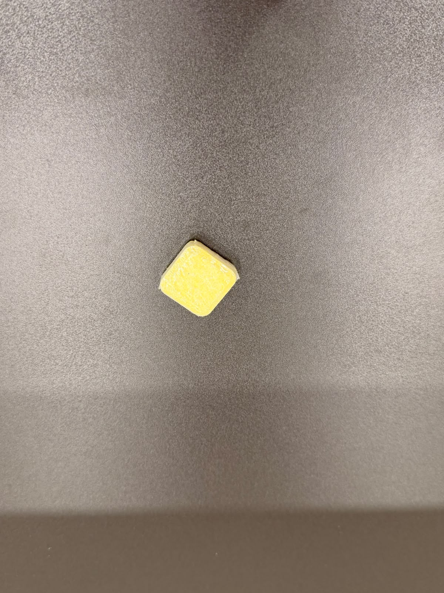

# Class carry_my_luggage (carry_my_luggage)

| Objectname               |  Image                   |
:-------------------------:|:-------------------------:
| bag |  |

# Class clean_the_table (clean_the_table)

| Objectname               |  Image                   |
:-------------------------:|:-------------------------:
| dishwasher_tab |  |
